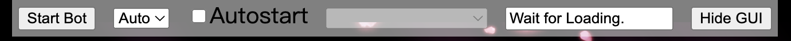

## プロジェクトについて

このプロジェクトは、ブラウザで[雀魂 -じゃんたま-](https://game.mahjongsoul.com/)用の麻雀AIです。 ライブラリは使わず、すべてネイティブのジャバスクリプトで作りました。  
AIは機械学習ではなく、従来のアルゴリズムを用いている。 簡単に言うといくつかのターンをシミュレートして、最適な手を探しているのです。  
三人麻雀と四人麻雀の両モードに対応。  
[Click here for the English readme.](https://github.com/Jimboom7/AlphaJong/blob/master/readme.md)  
[中文自述在这里.](https://github.com/Jimboom7/AlphaJong/blob/master/readme_cn.md)  

## 使用方法

* ユーザースクリプトを実行できるブラウザ拡張機能（例：[Tampermonkey](https://www.tampermonkey.net/?locale=ja)）をインストールする。
* この[最新リリース](https://github.com/Jimboom7/AlphaJong/releases)を入手し、ブラウザの拡張機能にインストールします。 (Tampermonkeyの場合は、ユーティリティ -> URL からインポートで、ダウンロードURLを入力します)。
* [雀魂 -じゃんたま-](https://game.mahjongsoul.com/)を開き、ログインしていることを確認します。
* ゲームに入り、上部のGUIで「Start Bot」をクリックします。
* 「Autostart」にチェックを入れると、ボットが自動的に次のゲームを開始します。
* ログはブラウザのコンソールに出力されます。

### BANにならないために
準備なしにBANを受けるリスクは高い。 [MajSoul Mod Plus](https://github.com/Avenshy/majsoul_mod_plus)はBANを回避する方法を提供しています。以下、その使い方を紹介します:
1. [Header Editor](https://he.firefoxcn.net/en/) プラグインをインストールする.
2. プラグインを開き、`Export and Import`タブに移動します。
3. `Download Rule`として`https://cdn.jsdelivr.net/gh/Avenshy/majsoul_mod_plus/header%20editor.json`を記入し、右のダウンロードボタンを押す。
4. `Suggested Group`を選び、`Save`をクリックします。
5. **Tampermonkeyが無効になっていることを確認し**、雀魂のゲームウェブページを開いてください。
6. ブラウザのキャッシュをクリアします(下の画像を参照)。F12キーを押してブラウザのコンソールを開き、`Application`タブを開きます。`Storage`を選択し、`Cache storage`にチェックを入れます。そして、`Clear site data`というボタンをクリックします。
7. ウェブページをリフレッシし（F5）、ブラウザのコンソールを確認します。一番上に"CODE.JS替换成功！"と表示されているはずで、これは成功したことを意味します。
8. Tampermonkeyを有効にし、BANされることなくこのボットを使用できるようになりました。

**注意**: ゲームが新しいバージョンにアップデートされ、コードが動作しなくなった場合、まずキャッシュをもう一度クリーニングしてみてください（上の画像にあるように）。 それがうまくいかない場合、安全なコードを更新する必要がある:
1. [MajSoul Mod Plusのsafe_code.js](https://github.com/Avenshy/majsoul_mod_plus) がまだ新しいバージョンに更新されていないか確認します。
2. その場合は、このリンクをクリックして更新してください。: [jsdelivr_purge_cache](https://purge.jsdelivr.net/gh/Avenshy/majsoul_mod_plus/safe_code.js)。 `"status": "finished"`は成功を意味する。
3. 雀魂に入り、ブラウザのキャッシュをクリアし、ページを更新する。

上記の手順で問題が発生した場合は、[MajSoul Mod Plus](https://github.com/Avenshy/majsoul_mod_plus)で質問してください。

### GUI

ボットを制御するための簡単なGUIがあります。  
* 左ボタン: ボットを起動または停止します。
* ComboBox：AIモード，2つのAIモードがあります。
   * AUTO：プレーヤーの操作を自動的に支援します
   * HELP：ヒントのみを提供し、動作しません
* チェックボックス: オートランモードを有効にする。前のゲームが終了した後にボットは自動的にサイトを再読み込みし、新しいゲームを検索します。ルームは隣のコンボボックスで選択することができます。
* テキストボックス: ボットが現在行っていること、あるいは待っていることを見せます。
* 右ボタンです: GUIを隠します。テンキーで＋を押すと再表示されます。

### パラメーター
デフォルトのパラメータは大抵問題ありません。ボットの挙動を変更したい場合（例えば、より攻撃的なプレイスタイルなど）、スクリプトの先頭で定数を変更することができます:

* Defense: 防衛のプレイスタイルを変更する定数です。
* Calls: ボットがタイルを呼び出す頻度を変更する定数です。
* Hand Evaluation Constants: 手牌の価値を計算する方法を変更する定数です。ボットが速い手と高い手のどちらを選ぶかに影響する。
* Strategy Constants: 戦略を修正する定数です。

## 成果

ボットは雀豪に到達することができます。

## テスト

簡単な「何切る?」テストが含まれています。

## 既知の問題点

-時としてゲームが無為のためにコネクションを切ることがあります。 ブラウザが最小化されていたり、別のタブを使用していることが原因である可能性があります。